# Hi, I'm Md. Emon Akon 👋

# Full-Stack Engineer | Next.js • Node.js • AI • Real-Time Systems

### **Built 4 Production-Style Applications • AI SaaS • Event-Driven Systems • Business Automation**

Building software that solves real business problems—not tutorial projects.

**🇧🇩 Bangladesh • Open for Freelance • Contract • Remote**

---

## About Me

I build complete software products—from polished **Next.js** interfaces to scalable **Node.js** backends with authentication, AI workflows, real-time communication, billing systems, and production-grade architecture.

Instead of chasing every new framework, I enjoy building software that solves real business problems and can actually be used in production.

---

# Core Expertise

<table>
<tr>
<td align="center" width="25%"> <b>Scalable APIs</b></td>
<td align="center" width="25%"> <b>AI Workflows</b></td>
<td align="center" width="25%"> <b>Real-Time Systems</b></td>
<td align="center" width="25%"> <b>Secure Authentication</b></td>
</tr>
</table>

---

# Tech Stack

### Frontend

### Backend

### Real-Time & Architecture

### Integrations

---

# Featured Projects

## ⭐ NextCall — AI Voice Receptionist SaaS

**Production SaaS • Live Product**

> **Turn missed calls into booked appointments with a 24/7 AI receptionist.**

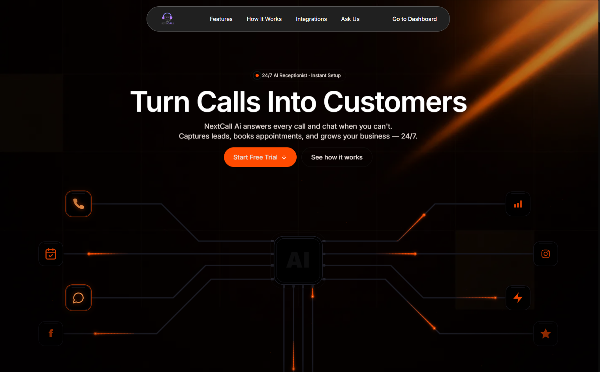

Businesses lose customers every time a phone call goes unanswered.

NextCall replaces missed calls with a **24/7 AI receptionist** that answers calls naturally, captures leads, books appointments into Google Calendar, sends SMS confirmations, and keeps business owners updated through a real-time dashboard—all without hiring additional front-desk staff.

### Why businesses would use it

- Never miss customer calls.
- Book appointments automatically.
- Send instant SMS confirmations.
- Reduce receptionist workload.
- Scale customer support around the clock.

### Feature Highlights

`Voice AI` • `Google Calendar` • `SMS` • `WhatsApp` • `Redis` • `Webhooks` • `Paddle`

### Product Preview

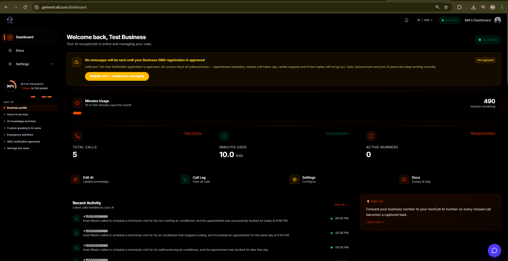
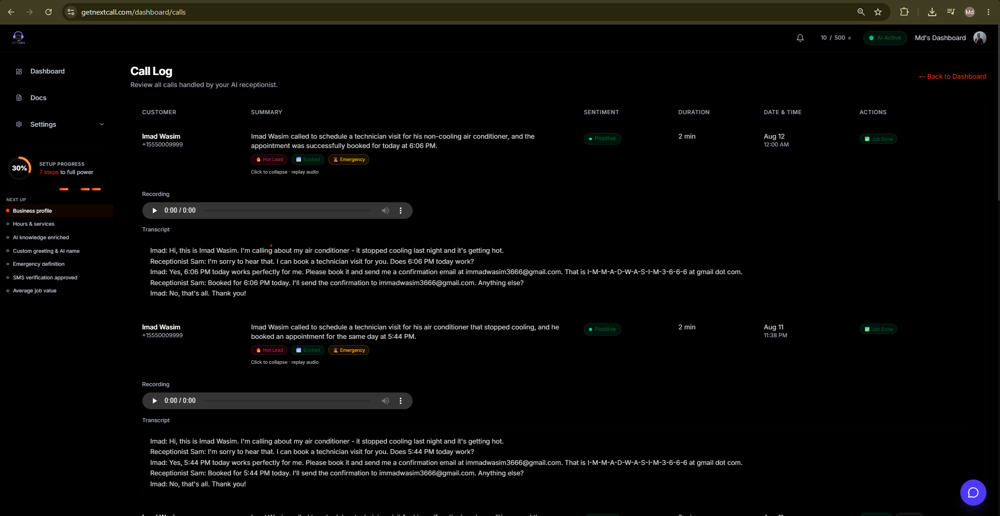

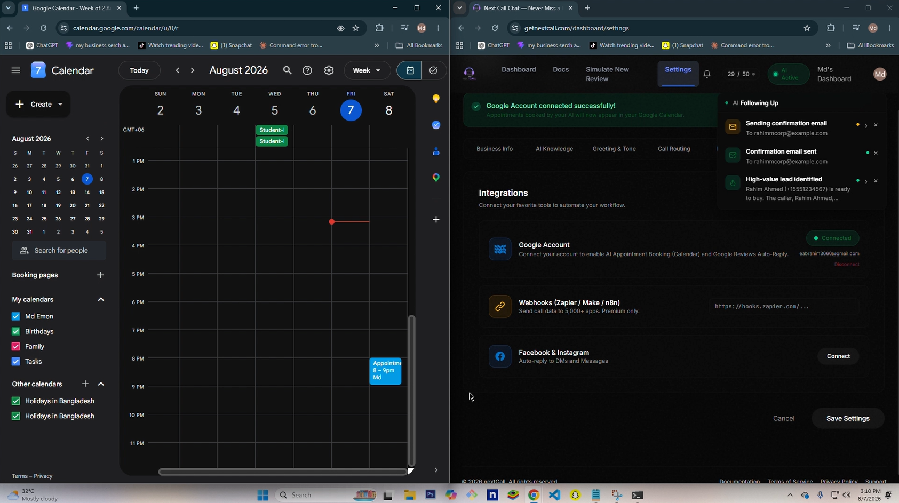
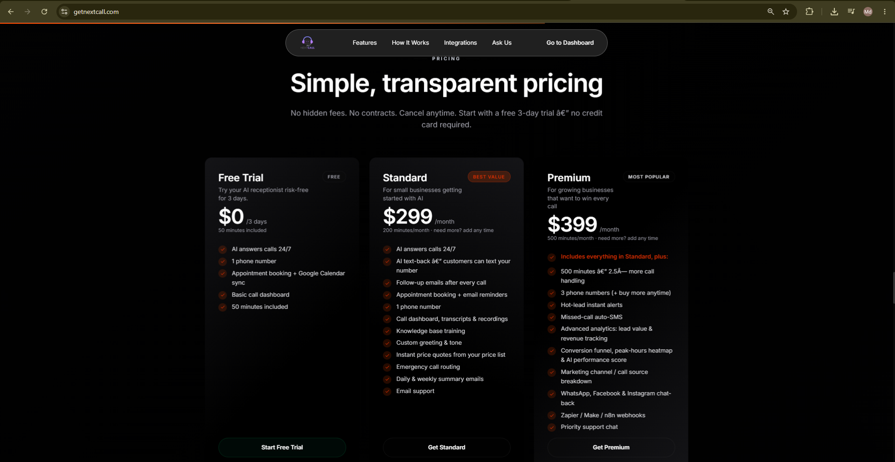

---

## 🚀 NextCall Marketing App *(Internal Tool)*

**Internal Tool • Private Workflow**

> A private AI-powered growth platform built exclusively to market NextCall.

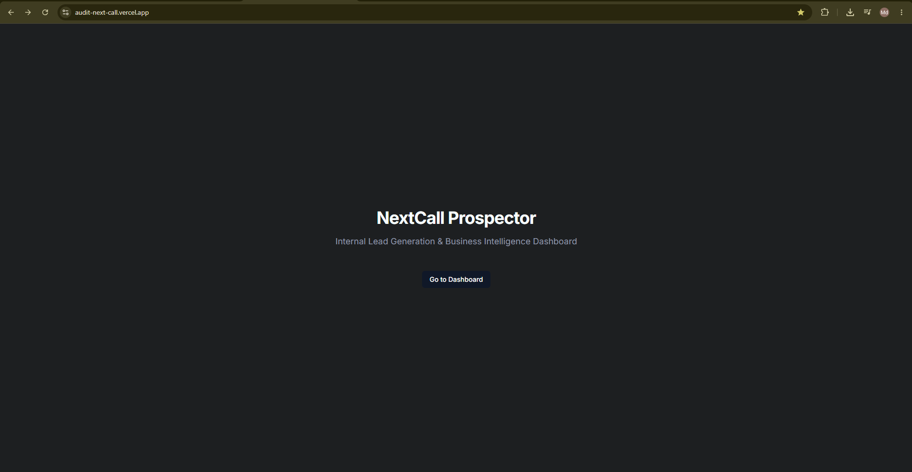

Instead of manually searching for local businesses, this platform discovers businesses, analyzes their online presence, generates AI-powered audit reports, and prepares personalized outreach campaigns automatically.

### Feature Highlights

`Business Discovery` • `AI Audits` • `PDF Reports` • `Email Campaigns` • `Lead Management`

### Dashboard Preview

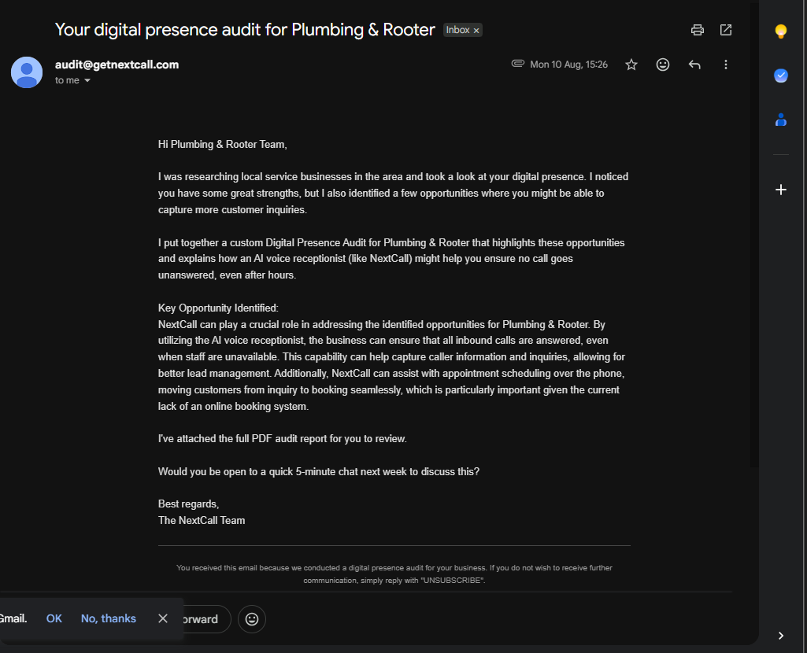
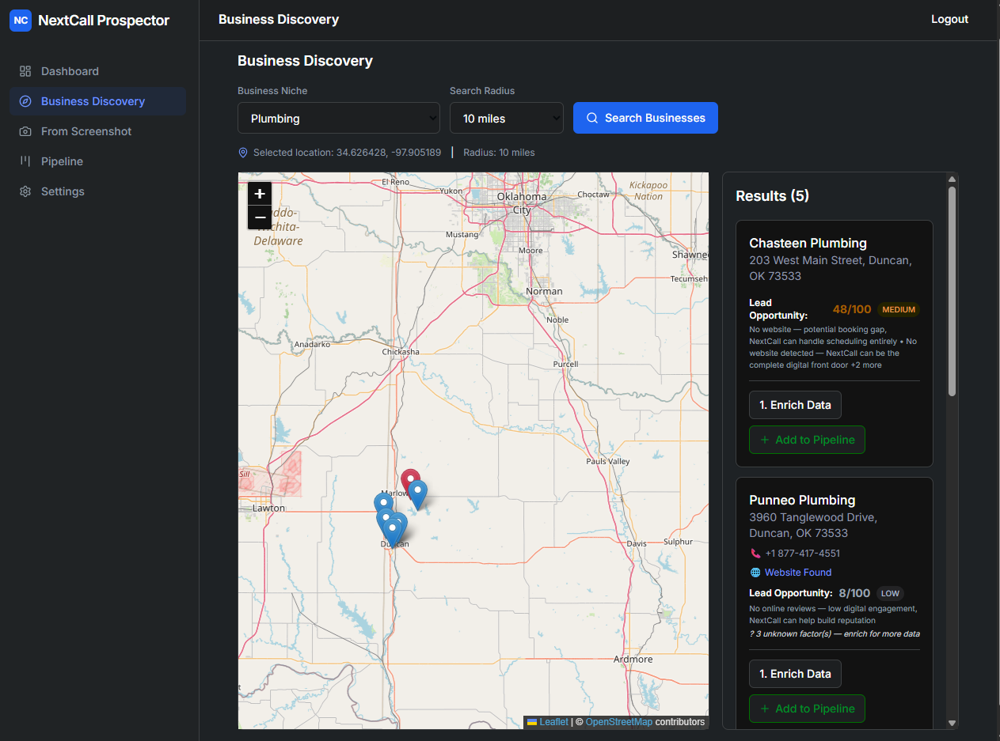
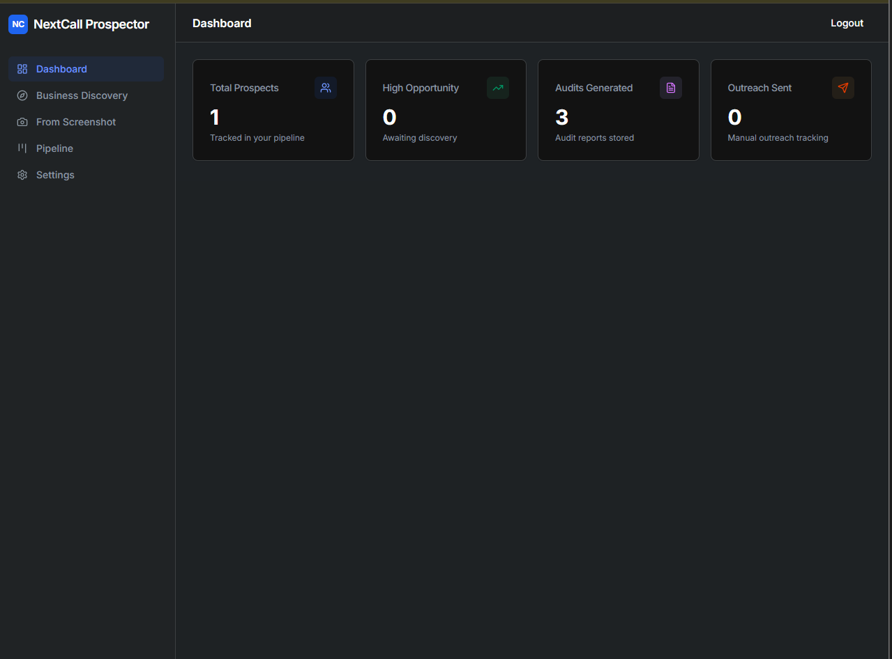

---

## ⚡ Daraz Backend API

**Modular Monolith • Event-Driven Architecture**

> Production-style multi-vendor eCommerce backend built with Redis, Kafka-ready events, Stripe webhooks, Shippo fulfilment, and Socket.IO.

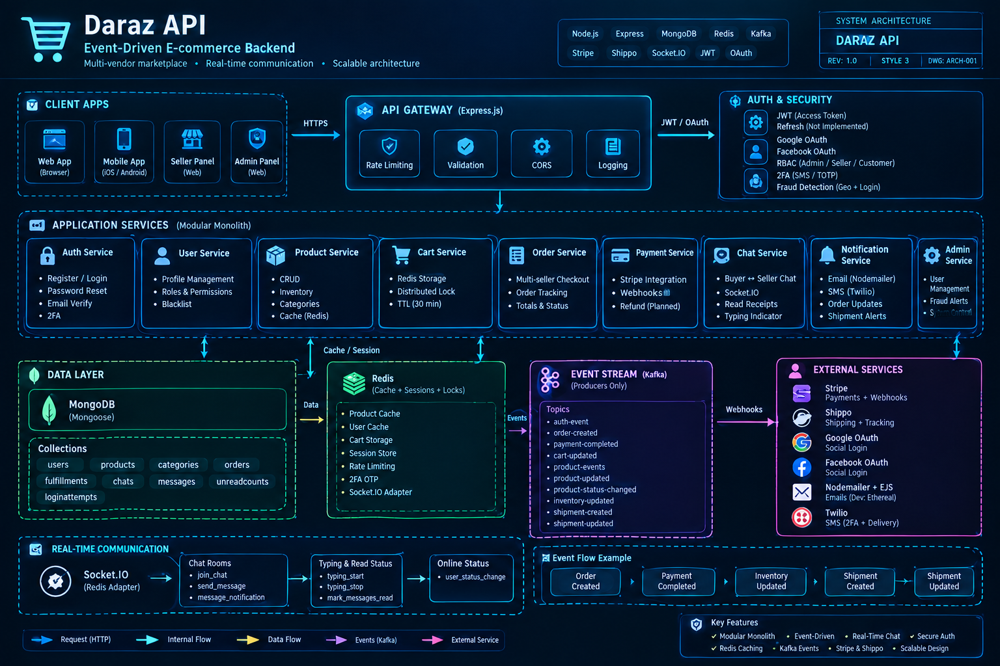

Rather than building isolated CRUD APIs, this project explores how scalable commerce systems can combine asynchronous workflows, caching, and real-time communication inside a **modular monolith** that's ready for future service separation.

### Tech Used

`Node.js` • `Express` • `MongoDB` • `Redis` • `Kafka` • `Socket.IO`

### Engineering Highlights

- Kafka-ready event producers
- Redis caching & distributed locking
- Buyer ↔ Seller real-time chat
- JWT Authentication
- Google OAuth
- Stripe Webhooks
- Shippo Shipping Integration

### Technical Preview

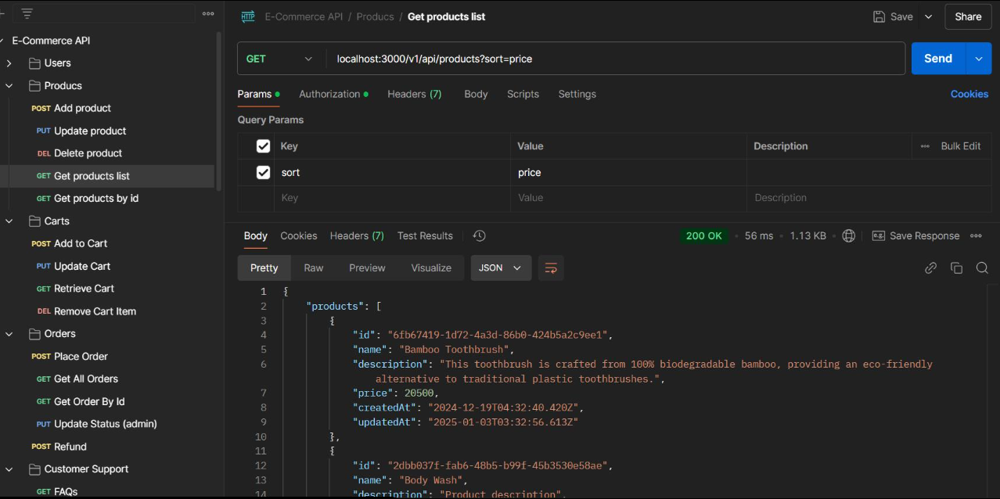
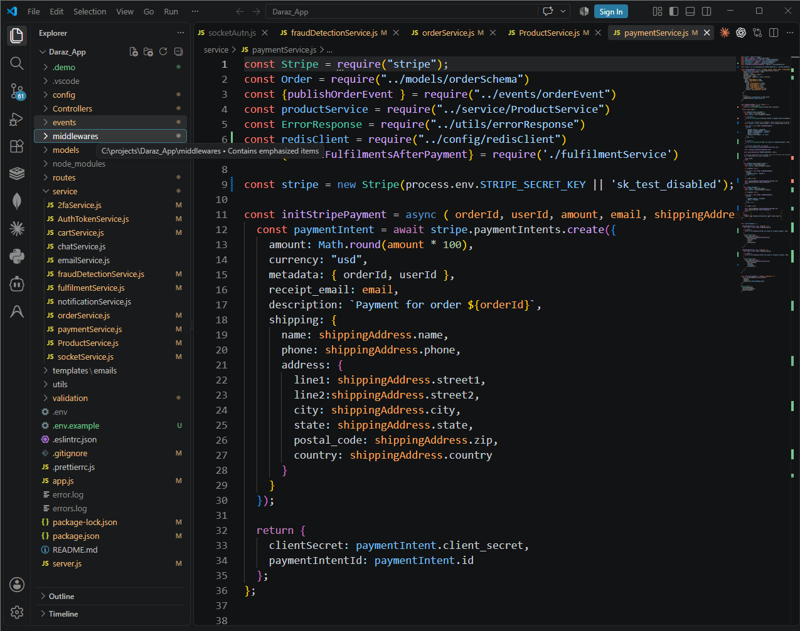

---

## 📱 PhoneMarket (SS Trade Express)

**Frontend Showcase • Premium UI**

> Apple-inspired smartphone storefront focused on a premium shopping experience.

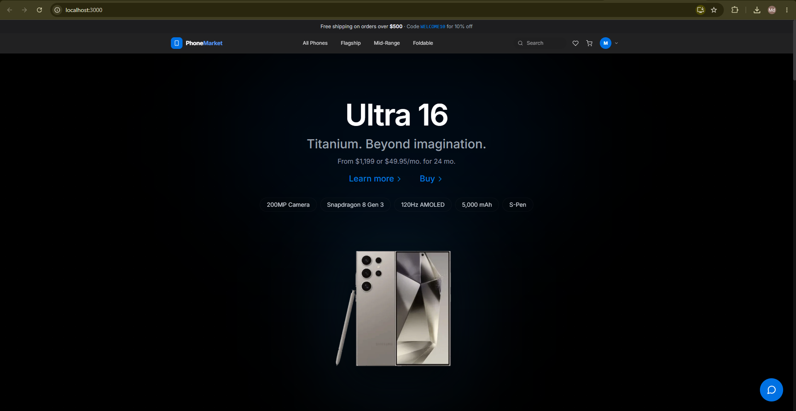

PhoneMarket recreates a premium smartphone shopping experience with modern UI interactions, a clean product presentation, and an elegant admin dashboard designed for a realistic eCommerce workflow.

### Feature Highlights

`Next.js UI` • `Modern Dashboard` • `Inventory UI` • `Customer Chat` • `Responsive Design`

### Preview

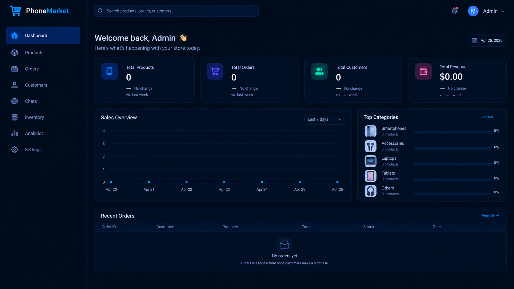
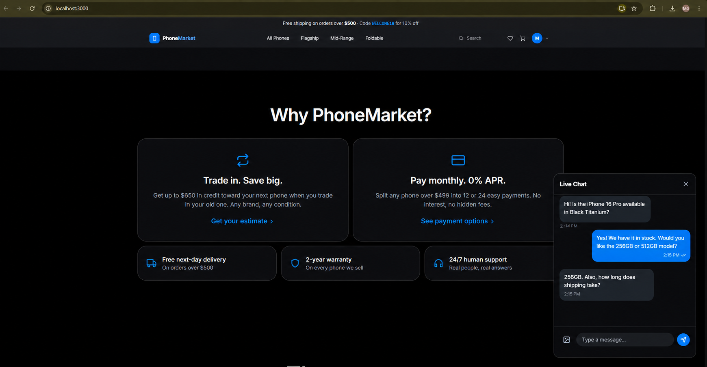

---

# Engineering Highlights

✔ Built **4 production-style applications** within a year of hands-on development.

✔ Built **NextCall** from scratch in approximately **3 months**.

### Backend

- JWT Authentication
- Google OAuth
- Redis
- Kafka
- Socket.IO
- Event-Driven Architecture

### Integrations

- OpenAI
- Twilio
- Paddle
- Stripe
- Google Calendar
- Production Webhooks

---

# GitHub Analytics

---

# Let's Build Something

I'm available for **Freelance**, **Contract**, and **Remote** work.

📧 **[eabrahim3666@gmail.com](mailto:eabrahim3666@gmail.com)**

💼 **[linkedin.com/in/md-emon-4a0501380](https://linkedin.com/in/md-emon-4a0501380)**

🌐 **[github.com/eabrahim3666-coder](https://github.com/eabrahim3666-coder)**

---

### Building software that solves real business problems.

